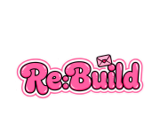

<div align="center">



**덕성 멋사 13기 데모데이**

</div>

<br/>

## 🙋🏻‍♀️ RE:build의 FE Developer를 소개합니다!

| <a href="https://github.com/aney0714"></a> | <a href="https://github.com/yangyangeeee"></a> |
| --- | --- |
| 김예나 | 양서윤 |
| 회원가입 페이지<br/>로그인 페이지<br/>커뮤니티 페이지<br/>채팅 페이지<br/>비밀2 페이지 | 프로젝트 초기세팅<br/>온보딩 페이지<br/>메인 페이지<br/>편지 페이지<br/>비밀 페이지<br/>전화 페이지 |

<br>

## 💌 서비스 소개
### 헤어진 기억을 재구성하고, 새로운 추억으로 다시 설계해주는 심리·체험 기반 회복 앱 ###

<br>

## 💻 기술 스택

| **역할** | **종류** | **선정 이유** |
| --- | --- | --- |
| Framework / Library |  | 컴포넌트 단위 개발이 가능하여 UI 재사용성과 유지보수성이 뛰어나고, 사용자 인터랙션이 많은 서비스 개발에 적합 |
| Language |  | 정적 타입 제공을 통해 런타임 오류를 사전에 방지하고, 코드 가독성 및 협업 효율을 극대화 |
| Bundler / Build Tool  |  | 빠른 개발 서버와 번들링 성능을 제공하며, React + TS 환경에서 최적화된 개발 경험 제공 |
| Routing |  | 페이지 이동 및 SPA 구조에 필요한 라우팅 기능을 안정적으로 제공하며, 동적 라우팅과 네비게이션 처리에 용이 |
| Styling |  | 컴포넌트 단위 스타일 관리가 가능하며, props 기반 스타일링으로 동적 UI 구현이 쉬움. 또한한 CSS 분리 없이 유지보수가 용이 |
| Data Fetching |  | Promise 기반 HTTP 클라이언트로, API 호출 시 직관적인 문법과 인터셉터 기능을 제공하여 유지보수가 쉬움  |
| Package Manager |  | 풍부한 라이브러리 생태계를 활용할 수 있고 프로젝트 환경 관리가 용이 |
| Version Control |  | 브랜치 전략을 통한 협업이 용이하고, 코드 변경 이력 관리 및 리뷰 과정이 효율적 |
| Repository Hosting |  | Pull Request 기반 협업, 코드 리뷰, 이슈 관리 등 협업 워크플로우 최적화 가능 |

  <br>

### ✨ Flow
- 각자 본인의 이름으로 된 개인 브랜치에서 작업을 진행하고, 작업 완료 후 `dev` 브랜치로 Pull Request를 보내 병합하는 방식을 사용함.

- 개인 작업 브랜치 생성 (예: `김예나`, `양서윤`)
- 작업 완료하고 커밋 메시지로 커밋
- 원격 저장소로 Push 후 Pull Request 생성
- `dev` 브랜치로 병합

<br>

## 📂 프로젝트 구조

```
📦RE-build
┣ 📂public
┗ 📜.gitignore
┗ 📜eslint.config.js
┗ 📜index.html
┗ 📜package-lock.json
┗ 📜package.json
┗ 📜README.md
┗ 📜tsconfig.app.json
┗ 📜tsconfig.json
┗ 📜tsconfig.node.json
┗ 📜vite.config.ts
┃ ┗ 📜vite.svg
┣ 📂src
┃ ┣ 📂api
┃ ┣ 📂assets
┃ ┣ 📂components
┃ ┃ ┣ 📂common
┃ ┃ ┣ 📂pages
┃ ┃ ┗ 📜Header.tsx
┃ ┃ ┗ 📜HeaderStyle.ts
┃ ┃ ┗ 📜NavBar.tsx
┃ ┃ ┃ ┗ 📜AppContainer.tsx
┃ ┣ 📂pages
┃ ┃ ┣ 📂Call
┃ ┃ ┃ ┣ 📂components
┃ ┃ ┃ ┗ 📜Calling.style.ts
┃ ┃ ┃ ┗ 📜Calling.tsx
┃ ┃ ┃ ┗ 📜CallPage.style.ts
┃ ┃ ┃ ┗ 📜CallPage.tsx
┃ ┃ ┣ 📂Community
┃ ┃ ┃ ┗ 📜Comments.tsx
┃ ┃ ┃ ┗ 📜CommunityWrite.tsx
┃ ┃ ┃ ┗ 📜PostList.tsx
┃ ┃ ┣ 📂Home
┃ ┃ ┃ ┣ 📂components
┃ ┃ ┃ ┃ ┣ 📂CommunityCard
┃ ┃ ┃ ┃ ┣ 📂ReasonCard
┃ ┃ ┃ ┃ ┣ 📂SinceCard
┃ ┃ ┃ ┃ ┣ 📂TodayCard
┃ ┃ ┃ ┃ ┣ 📂TodoCard
┃ ┃ ┃ ┗ 📜Home.style.ts
┃ ┃ ┃ ┗ 📜Home.tsx
┃ ┃ ┃ ┗ 📜MainPage.style.ts
┃ ┃ ┃ ┗ 📜MainPage.tsx
┃ ┃ ┃ ┗ 📜Start.style.ts
┃ ┃ ┃ ┗ 📜Start.tsx
┃ ┃ ┣ 📂Letter
┃ ┃ ┃ ┣ 📂components
┃ ┃ ┃ ┗ 📜KakaoTalk.tsx
┃ ┃ ┃ ┗ 📜LetterDetailPage.style.ts
┃ ┃ ┃ ┗ 📜LetterDetailPage.tsx
┃ ┃ ┃ ┗ 📜LetterSelectPage.style.ts
┃ ┃ ┃ ┗ 📜LetterSelectPage.tsx
┃ ┃ ┃ ┗ 📜LetterWritePage.style.ts
┃ ┃ ┃ ┗ 📜LetterWritePage.tsx
┃ ┃ ┣ 📂OnBoarding
┃ ┃ ┃ ┣ 📂components
┃ ┃ ┃ ┣ 📂screens
┃ ┃ ┃ ┗ 📜OnBoarding.tsx
┃ ┃ ┃ ┗ 📜OnBoardingStyle.ts
┃ ┃ ┣ 📂Secret
┃ ┃ ┃ ┗ 📜MySecret.syle.ts
┃ ┃ ┃ ┗ 📜MySecret.tsx
┃ ┃ ┃ ┗ 📜Secret1.tsx
┃ ┃ ┃ ┗ 📜Secret2.tsx
┃ ┃ ┃ ┗ 📜SecretLockPage.style.ts
┃ ┃ ┃ ┗ 📜SecretLockPage.tsx
┃ ┃ ┣ 📂SignUp
┃ ┃ ┃ ┗ 📜Signup.tsx
┃ ┣ 📂styles
┃ ┗ 📜App.css
┃ ┗ 📜App.tsx
┃ ┗ 📜index.css
┃ ┗ 📜main.tsx
┃ ┗ 📜types.ts
...


- public
- src
  - api - 서버와 통신하는 API 함수 모음
  - assets - 프로젝트에서 사용하는 모든 이미지, 아이콘 svg 리소스
  - components - 전역에서 재사용되는 공용 UI 컴포넌트 모음
  - styles - 프로젝트 전영에서 사용하는 스타일 파일
  - pages - 실제 라우팅되는 페이지 컴포넌트
  - types - TypeScript 타입 정의 모음
